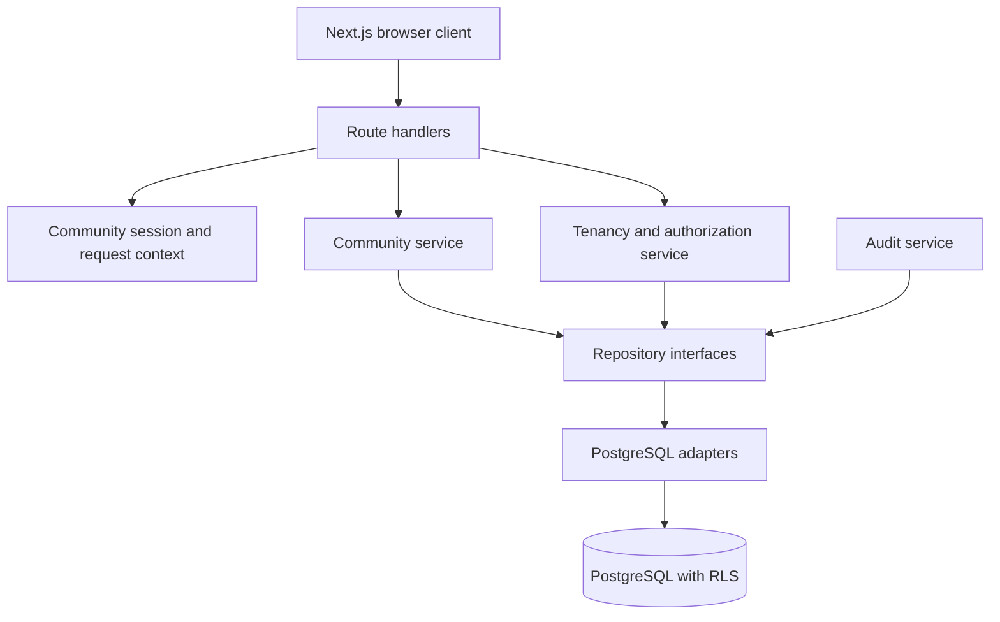
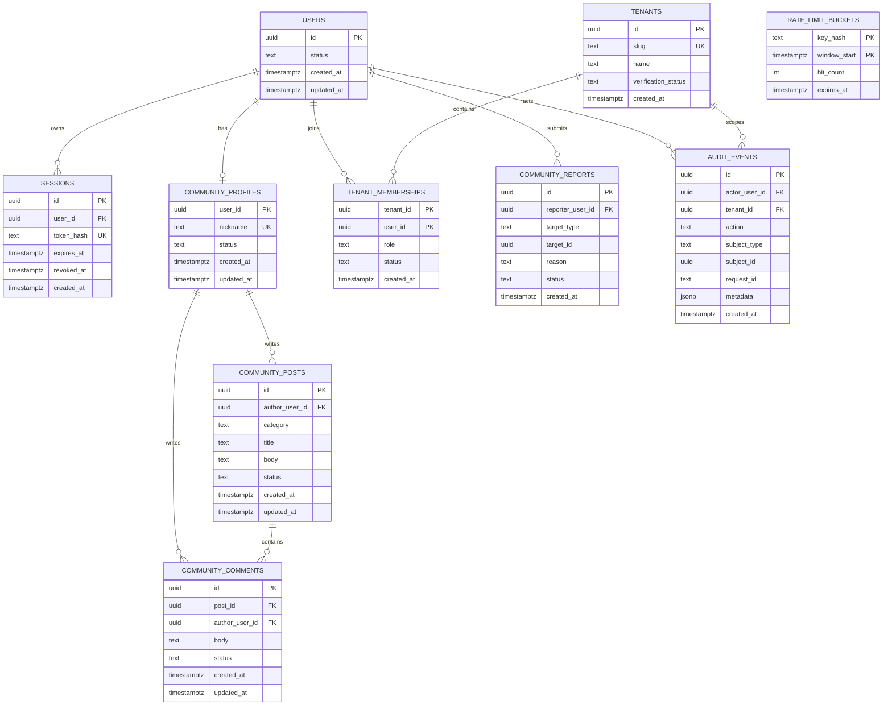

# Enter-AX Community and Enterprise Backend Foundation Design

- Date: 2026-09-18
- Status: Approved design, pending implementation plan
- Scope: First production backend slice for the applicant community and enterprise AX platform

## 1. Goal

Build the first production-capable backend foundation without replacing the existing Next.js application. The slice provides PostgreSQL persistence, tenant isolation, pseudonymous community identities, community posts/comments/reports, audit events, server-side validation, and an API-backed community UI.

This slice deliberately does not implement media workers, real OAuth or identity verification providers, audition applications, offers, or Hermes execution. It creates explicit interfaces and data boundaries so those features can be added without rewriting the community or tenancy foundation.

## 2. Product Boundary

Enter-AX has two product surfaces that share a trust foundation:

1. Applicant community: pseudonymous participation, audition information, peer support, reports, and moderation.
2. Enterprise AX: tenant-scoped workspaces, members, workflow definitions, approvals, and auditability.

Community identity and audition identity must not be publicly linkable by default. Enterprise users must never be able to query community activity through talent or audition records. A future explicit consent grant may connect selected applicant data to a verified agency, but community post history remains outside that grant.

## 3. Architectural Approach

Use a modular monolith inside the existing Next.js application. The web deployment and API deployment remain one unit for the first release, while business modules communicate through typed interfaces rather than importing database details directly.

### Alternatives rejected for this slice

- Supabase-first: fast initial delivery, but couples identity, authorization, and database access to one vendor before the enterprise isolation model is validated.
- Separate NestJS API: a valid later extraction target, but adds a second deployment, duplicated configuration, and type distribution before the product has enough backend surface to justify it.

## 4. Module Boundaries

### 4.1 Database module

Responsibilities:

- Own PostgreSQL connection creation.
- Provide transaction helpers.
- Set request-scoped PostgreSQL settings used by RLS.
- Never expose a raw database client to React components or route handlers.

Configuration:

- `DATABASE_URL` is required for the PostgreSQL adapter.
- The production application connects with a non-owner database role.
- Migration ownership remains on a separate owner role.
- Runtime connections set `app.user_id` and `app.tenant_id` inside transactions before tenant-scoped queries.

### 4.2 Identity and session module

The first slice supports a pseudonymous community session, not full identity verification.

- A new visitor requests a community session.
- The server creates a `users` row and a `community_profiles` row in one transaction.
- The server returns an opaque, cryptographically random session token in an `HttpOnly`, `SameSite=Lax` cookie.
- Only a SHA-256 hash of the token is stored in PostgreSQL.
- Sessions expire and can be revoked.
- Client-provided author names or user IDs are never treated as identity.
- Production requires `SESSION_COOKIE_SECURE=true`; local HTTP development may set it to false.

The session module exposes `getRequestActor(request)` returning an authenticated platform actor or an anonymous result. Future OAuth and verified applicant identity providers must implement the same actor interface.

### 4.3 Community module

Responsibilities:

- List published posts with cursor pagination and optional category filtering.
- Create a post for the authenticated community profile.
- List and create comments.
- Submit a report against a post or comment.
- Prevent duplicate open reports from the same reporter for the same target.
- Hide removed content from normal readers.

Initial categories retain the current product vocabulary: `free`, `question`, `success-story`, and `information`.

Post and comment bodies are stored as plain text. Rendering must not interpret user input as HTML. Limits are enforced on the server:

- nickname: 2-20 Unicode characters after trimming
- title: 2-120 characters
- post body: 2-10,000 characters
- comment body: 1-2,000 characters
- report reason: 2-500 characters
- page size: default 20, maximum 50

### 4.4 Tenancy module

Responsibilities:

- Represent verified agency tenants.
- Represent tenant memberships and platform roles.
- Resolve a tenant actor only when the user has an active membership.
- Supply authorization guards for later AX, candidate, and content modules.

Initial tenant roles are `owner`, `admin`, `member`, and `viewer`. The foundation does not expose tenant mutation APIs yet; seed or administrative migration data is sufficient for this slice.

### 4.5 Audit module

Audit events are append-only application records for security-relevant mutations.

Each event records:

- platform user ID when present
- tenant ID when present
- action name
- subject type and subject ID
- request correlation ID
- timestamp
- safe JSON metadata without secrets, session tokens, or user-generated body content

The first slice records session creation, community post creation, comment creation, report submission, and authorization denial.

## 5. Data Model

All primary identifiers use UUIDs generated by PostgreSQL. Timestamps use `timestamptz` in UTC. Status and role columns use check constraints so a migration is required to add new values deliberately.

## 6. Row-Level Security

RLS is defense in depth and does not replace application authorization.

- `community_posts` and `community_comments`: published content is readable by normal runtime actors; authors can insert as themselves; mutation policies require author ownership.
- `sessions`: readable and revocable only for the current `app.user_id`; token lookup is performed by a narrowly scoped security-definer function owned by the migration role.
- `tenant_memberships`: users can see their memberships; tenant administration is not exposed in this slice.
- future tenant-owned tables: require `tenant_id = current_setting('app.tenant_id', true)::uuid`.
- `audit_events`: insert is allowed through the application transaction context; normal runtime actors cannot update or delete events.

Every protected table enables and forces RLS. The application runtime role must not own tables and must not have `BYPASSRLS`.

## 7. HTTP API

All responses use JSON. Errors use the shape `{ error: { code, message, requestId, fields? } }`. Unexpected errors return a generic message and are logged with the request ID.

### Session

- `POST /api/v1/community/session`
  - Input: `{ nickname }`
  - Creates an anonymous community account and cookie session.
  - Returns the community profile.
- `GET /api/v1/community/session`
  - Returns the current community profile or `401`.
- `DELETE /api/v1/community/session`
  - Revokes the session and clears the cookie.

### Posts

- `GET /api/v1/community/posts?category=&cursor=&limit=`
- `POST /api/v1/community/posts`
  - Input: `{ category, title, body }`
  - Requires a valid community session.
- `GET /api/v1/community/posts/:postId/comments?cursor=&limit=`
- `POST /api/v1/community/posts/:postId/comments`
  - Input: `{ body }`
  - Requires a valid community session.
- `POST /api/v1/community/reports`
  - Input: `{ targetType, targetId, reason }`
  - Requires a valid community session.

Mutation responses return `201` on creation. Validation returns `400`, missing sessions return `401`, denied access returns `403`, missing resources return `404`, and duplicate open reports return `409`.

## 8. UI Integration

Replace direct `DemoRepository` community mutations with a community client interface. Two adapters implement it:

- `ApiCommunityClient`: calls the HTTP API and is the default when `NEXT_PUBLIC_BACKEND_MODE=api`.
- `DemoCommunityClient`: preserves the existing local demo for previews and offline demonstrations.

The talent community page loads posts from the selected client, displays loading and error states, and creates sessions before the first write. The server supplies the nickname from the session; post and comment forms no longer send an author name for API mode.

No agency page behavior changes in this slice.

## 9. Error Handling and Security

- Validate all query parameters, route parameters, and request bodies at the server boundary with Zod.
- Apply per-IP session creation limits and per-user mutation limits through an injectable rate-limit interface. Local tests use an in-process adapter. Production API mode uses an atomic PostgreSQL adapter backed by `rate_limit_buckets`; keys are SHA-256 hashes and expired buckets are deleted opportunistically.
- Require same-origin `Origin` for cookie-authenticated mutations.
- Use parameterized SQL exclusively.
- Set session cookies to `HttpOnly`, `SameSite=Lax`, a scoped path, and configurable `Secure`.
- Never log session tokens, post bodies, comment bodies, or report reasons.
- Add request IDs to logs and responses.
- Keep community content plain text and rely on React escaping at render time.

## 10. Testing Strategy

Development follows red-green-refactor.

### Unit tests

- nickname, post, comment, report, cursor, and category validation
- session token hashing and cookie policy
- community service authorization and duplicate-report behavior
- tenant role resolution and denial
- error mapping

### Repository contract tests

Run the same community repository behavior suite against:

- an in-memory adapter used by unit tests
- the PostgreSQL adapter when `TEST_DATABASE_URL` is available

### Route tests

- session creation and cookie output
- post and comment creation without client-controlled author identity
- unauthenticated and cross-origin mutation rejection
- validation error shape
- pagination output

### UI tests

- loading and API failure states
- session onboarding before posting
- API-created posts and comments appearing without page reload
- demo adapter behavior remains available

### Verification

- targeted test suite for every red-green cycle
- full `npm test`
- `npm run typecheck`
- `npm run lint`
- `npm run build`

## 11. Migration and Rollout

1. Add dependencies, database module, migration runner, and Docker Compose PostgreSQL for local development.
2. Apply schema, runtime role grants, and RLS policies.
3. Implement identity/session, community, tenancy, and audit modules behind interfaces.
4. Add v1 route handlers.
5. Add the API community client and retain the demo client.
6. Run contract, route, UI, and full project verification.
7. Deploy with `NEXT_PUBLIC_BACKEND_MODE=demo` first.
8. Provision PostgreSQL in Preview, apply migrations with the owner role, verify the PostgreSQL rate limiter, and switch Preview to `api` mode.
9. Review audit logs, authorization failures, and moderation flow before enabling Production API mode.

## 12. Acceptance Criteria

- A visitor can create a pseudonymous community session and receives a secure opaque cookie.
- The authenticated visitor can create posts and comments without choosing or spoofing an author identity.
- Published posts can be listed by category with cursor pagination.
- A user can report a post or comment once while an earlier report remains open.
- Tenant membership resolution rejects inactive, missing, and cross-tenant membership.
- PostgreSQL tables, grants, and forced RLS policies enforce the documented ownership and tenant boundaries.
- Security-relevant mutations create audit events without storing content bodies or credentials.
- The community page works through the API adapter and the existing demo mode remains usable.
- Tests, type checking, linting, and production build pass.
